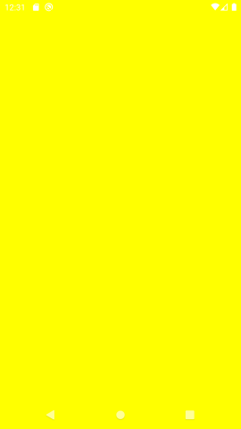

# ndk-egl-intro

Android Studio simple example how to use EGL/OpenGLES from native code.

Based on Khronos EGL Intro reference: https://www.khronos.org/registry/EGL/sdk/docs/man/html/eglIntro.xhtml

## Screenshots


## Notice
Due to Android Studio issue [AndroidStudio endless 'Scanning files to index…'](https://stackoverflow.com/questions/64546105/androidstudio-endless-scanning-files-to-index)
native_app_glue sources were localy copied to avoid it:
```
from
ndk/21.1.6352462/sources/android/native_app_glue
to
app/src/main/cpp/native_app_glue
```
